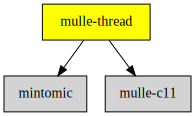

# mulle-thread

#### 🔠 Cross-platform thread/mutex/tss/atomic operations in C


# mulle-thread

#### 🔠 Cross-platform thread/mutex/tss/atomic operations in C

**mulle-thread** is a set of **C** wrapper headers for a simplified
subset of thread functions and for a limited range of atomic operations that
strongly mimics the thread standard, even if thread is not available. On Windows it
has to do a bit more work.

mulle-threads main advantages are **simplicity**, **portability**, **sanity**.

* basic atomic operations CAS, ++, -- on void pointers.
* basic thread operations
* mutex functionality
* thread local storage, with proper destruction

Since thread has `<stdatomic.h>` and `<threads.h>`, eventually this project
could become superflous. In the meantime though it's a convenient abstraction
on threads and atomic operations.

### Warning

`mulle_thread_once` doesn't guarantee, that exceptions or thread cancellation
within the init function will clear the once flag for a second run. In fact
it will not.


| Release Version
|-----------------------------------
| [](//github.com/mulle-concurrent/mulle-thread) 


| Release Version                                       | Release Notes
|-------------------------------------------------------|--------------
|  [](//github.com/mulle-concurrent/mulle-thread/actions) | [RELEASENOTES](RELEASENOTES.md) |


## API

* [Atomic Operations](dox/API_ATOMIC.md)
* [Threads](dox/API_THREAD.md)
* [Mutex](dox/API_MUTEX.md)
* [Thread Local Storage](dox/API_TSS.md)


## Convenience macro for mutex

An easy way to get a locked code region is to use:

``` c
void   foo( mulle_thread_mutex_t *mutex)
{
   mulle_thread_mutex_do( mutex)
   {
      // code block is now executed with mutex locked
   }
   // mutex is unlocked again
}
```

`break` and `continue` will exit the block and unlock the mutex. But when you
use `return` the function exists and the mutex remains locked.


### You are here




## Add

**This project is a component of the [mulle-core](//github.com/mulle-core/mulle-core) library. As such you usually will *not* add or install it
individually, unless you specifically do not want to link against
`mulle-core`.**


### Add as an individual component

Use [mulle-sde](//github.com/mulle-sde) to add mulle-thread to your project:

``` sh
mulle-sde add github:mulle-concurrent/mulle-thread
```

To only add the sources of mulle-thread with dependency
sources use [clib](https://github.com/clibs/clib):


``` sh
clib install --out src/mulle-concurrent mulle-concurrent/mulle-thread
```

Add `-isystem src/mulle-concurrent` to your `CFLAGS` and compile all the sources that were downloaded with your project.


## Install

### Install with mulle-sde

Use [mulle-sde](//github.com/mulle-sde) to build and install mulle-thread and all dependencies:

``` sh
mulle-sde install --prefix /usr/local \
   https://github.com/mulle-concurrent/mulle-thread/archive/latest.tar.gz
```

### Manual Installation

Install the requirements:

| Requirements                                 | Description
|----------------------------------------------|-----------------------
| [mulle-c11](https://github.com/mulle-c/mulle-c11)             | 🔀 Cross-platform C compiler glue (and some cpp conveniences)

Download the latest [tar](https://github.com/mulle-concurrent/mulle-thread/archive/refs/tags/latest.tar.gz) or [zip](https://github.com/mulle-concurrent/mulle-thread/archive/refs/tags/latest.zip) archive and unpack it.

Install **mulle-thread** into `/usr/local` with [cmake](https://cmake.org):

``` sh
cmake -B build \
      -DCMAKE_INSTALL_PREFIX=/usr/local \
      -DCMAKE_PREFIX_PATH=/usr/local \
      -DCMAKE_BUILD_TYPE=Release &&
cmake --build build --config Release &&
cmake --install build --config Release
```


## Author

[Nat!](https://mulle-kybernetik.com/weblog) for Mulle kybernetiK  


