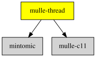

# mulle-thread

#### 🔠 Cross-platform thread/mutex/tss/atomic operations in C

**mulle-thread** is a set of **C** wrapper headers for a simplified
subset of thread functions and for a limited range of atomic operations that
strongly mimics the thread standard, even if thread is not available. On Windows it
has to do a bit more work.

mulle-threads main advantages are **simplicity**, **portability**, **sanity**.

* basic atomic operations CAS, ++, -- on void pointers.
* basic thread operations
* mutex functionality
* thread local storage, with proper destruction

Since thread has `<stdatomic.h>` and `<threads.h>`, eventually this project
could become superflous. In the meantime though it's a convenient abstraction
on threads and atomic operations.

### Warning

`mulle_thread_once` doesn't guarantee, that exceptions or thread cancellation
within the init function will clear the once flag for a second run. In fact
it will not.


| Release Version                                       | Release Notes  | AI Documentation
|-------------------------------------------------------|----------------|---------------
|  [](//github.com/mulle-concurrent/mulle-thread/actions) | [RELEASENOTES](RELEASENOTES.md) | [DeepWiki for mulle-thread](https://deepwiki.com/mulle-concurrent/mulle-thread)


## API

* [Atomic Operations](dox/API_ATOMIC.md)
* [Threads](dox/API_THREAD.md)
* [Mutex](dox/API_MUTEX.md)
* [Thread Local Storage](dox/API_TSS.md)


## Documentation & Guides

* [API Summary](asset/dox/api/toc)
* [Coder Guide](asset/howto/coder/mulle-thread)


## Convenience macro for mutex

An easy way to get a locked code region is to use:

``` c
void   foo( mulle_thread_mutex_t *mutex)
{
   mulle_thread_mutex_do( *mutex)
   {
      // code block is now executed with mutex locked
   }
   // mutex is unlocked again
}
```

The macro takes the address of its argument, so pass the mutex variable itself
(or `*mutex` if you only hold a pointer to it). `break` and `continue` will
exit the block and unlock the mutex. But when you use `return` the function
exits and the mutex remains locked.


## ThreadSanitizer requires the pthreads backend

By default mulle-thread uses the C11 `<threads.h>` backend when it is
available, so `mulle_thread_create` calls `thrd_create`. ThreadSanitizer
intercepts `pthread_create`, but not `thrd_create`: on glibc `thrd_create`
creates the thread through a libc-internal call that bypasses interposition.
The new thread therefore starts with no tsan thread state and crashes as soon
as it executes any instrumented code:

```
ThreadSanitizer:DEADLYSIGNAL
ERROR: ThreadSanitizer: SEGV on unknown address 0x000000000018 ...
```

The backtrace points at `__tsan_func_entry` at the top of the thread function,
which makes it look like a bug in your code. It is not. Force the pthreads
backend for sanitizer builds:

``` sh
cc -fsanitize=thread -DMULLE_THREAD_USE_PTHREADS ...
```

Reproduced with both gcc libtsan and clang, and fixed by the flag in both.
Note that a trivial thread function may survive, because with optimization
there is nothing left in it to instrument, so a smoke test can be misleading.

`MULLE_THREAD_USE_PTHREADS` is checked in `mulle-thread.h` before the backend
header is included, so use a compiler flag rather than a `#define` in a source
file. Use the same flag for any sanitizer or race detector that needs to
observe thread creation.


### You are here




## Add

mulle-thread is a component of the [mulle-core](//github.com/mulle-core/mulle-core) library. So in your code include the mulle-core umbrella header:

``` c
#include <mulle-core/mulle-core.h>
```

### Add mulle-core to a cmake and git project

``` bash
git submodule add https://github.com/mulle-core/mulle-core.git mulle-core
```

Add this to your `CMakeLists.txt`:

``` cmake
add_subdirectory( mulle-core)
target_link_libraries( ${PROJECT_NAME} PRIVATE mulle-core)
```


### Add mulle-core to a mulle-sde project

``` sh
mulle-sde add github:mulle-core/mulle-core
```

### Embed mulle-thread with clib

``` sh
clib install --out src mulle-concurrent/mulle-thread
```

Append `src` to your include path (e.g. add `-isystem src`  to your `CFLAGS`)
and compile all the sources that were downloaded.

## Install

Use [mulle-sde](//github.com/mulle-sde) to build and install mulle-thread and all dependencies:

``` sh
mulle-sde install --prefix /usr/local \
   https://github.com/mulle-concurrent/mulle-thread/archive/latest.tar.gz
```

### Legacy Installation

Install the requirements:

| Requirements                                 | Description
|----------------------------------------------|-----------------------
| [mulle-c11](https://github.com/mulle-c/mulle-c11)             | 🔀 Cross-platform C compiler glue (and some cpp conveniences)

Download the latest [tar](https://github.com/mulle-concurrent/mulle-thread/archive/refs/tags/latest.tar.gz) or [zip](https://github.com/mulle-concurrent/mulle-thread/archive/refs/tags/latest.zip) archive and unpack it.

Install **mulle-thread** into `/usr/local` with [cmake](https://cmake.org):

``` sh
PREFIX_DIR="/usr/local"
cmake -B build                               \
      -DMULLE_SDK_PATH="${PREFIX_DIR}"       \
      -DCMAKE_INSTALL_PREFIX="${PREFIX_DIR}" \
      -DCMAKE_PREFIX_PATH="${PREFIX_DIR}"    \
      -DCMAKE_BUILD_TYPE=Release &&
cmake --build build --config Release &&
cmake --install build --config Release
```


## Author

[Nat!](https://mulle-kybernetik.com/weblog) for Mulle kybernetiK  


